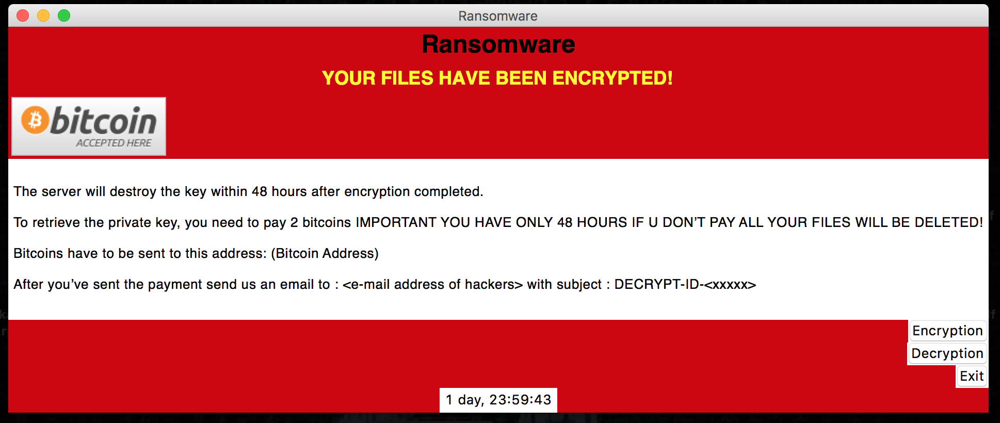
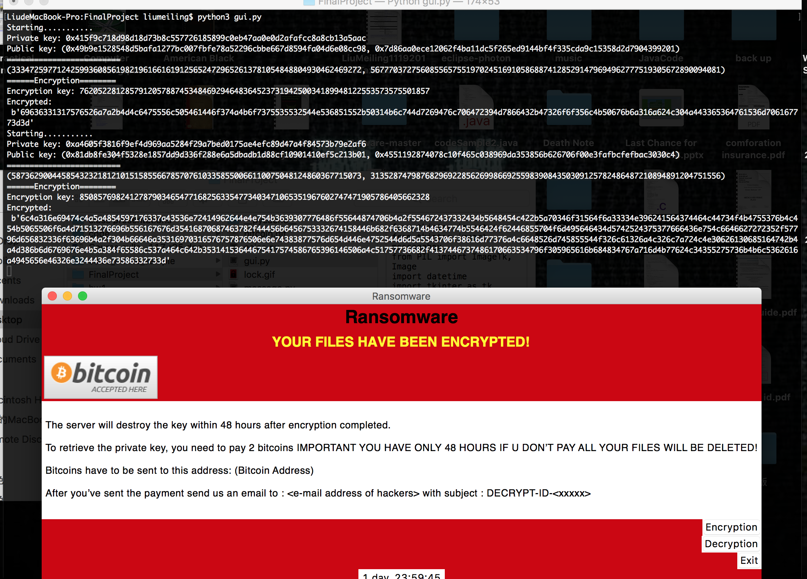
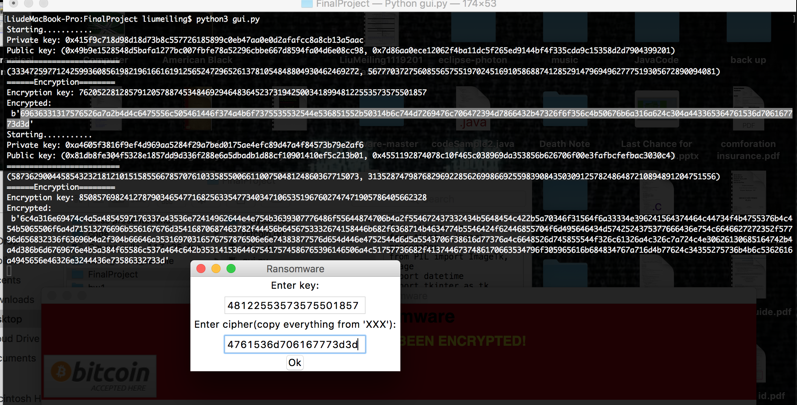
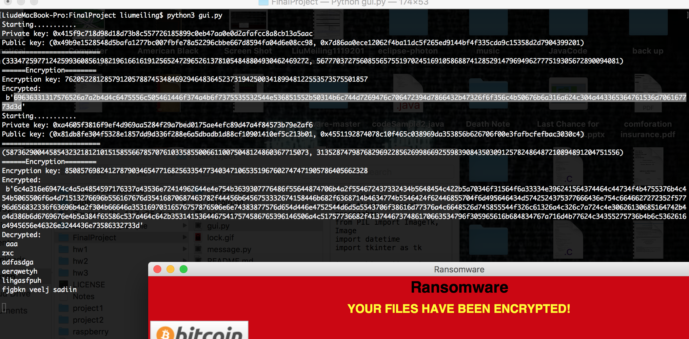

#  Ransomwhere

## Getting Started

This program uses the version of Python 3, continuing previous [ecies](https://github.com/CryptoUSF/mliu45/tree/master/hw3) work.


Libraries use for this program:
```
import click
from Crypto.Cipher import AES
```
Please be sure to install following libraries: 
```
pip3 install click
pip3 install pycrypto
```


## How Ransomware Works
According to an IEEE Security and Privacy conference presentation in 1996 (Adam Young and Moti Yung), this is how ransomware works:

* [attacker→victim] The attacker generates a key pair and places the corresponding public key in the malware. The malware is released.
* [victim→attacker] To carry out the cryptoviral extortion attack, the malware generates a random symmetric key and encrypts the victim’s data with it. It uses the public key in the malware to encrypt the symmetric key. This is known as hybrid encryption and it results in a small asymmetric ciphertext as well as the symmetric ciphertext of the victim’s data. It zeroizes the symmetric key and the original plaintext data to prevent recovery. It puts up a message to the user that includes the asymmetric ciphertext and how to pay the ransom. The victim sends the asymmetric ciphertext and e-money to the attacker.
* [attacker→victim] The attacker receives the payment, deciphers the asymmetric ciphertext with the attacker’s private key, and sends the symmetric key to the victim. The victim deciphers the encrypted data with the needed symmetric key thereby completing the cryptovirology attack.
[Hack Noon](https://hackernoon.com/cryptography-malware-ransomware-36a8ae9eb0b9)


## How This Program Works
1. Generates an AES-256 bit key and display on the screen
2. Searches relevant locations (network drives, user directories, etc.) for matching files (in this program, search TopSecret/ as sample)
3. Encrypts all matching files
4. Displays the Crypter GUI to the victim

## Running the tests

### Usage
```
python3 gui.py
```


### Encryption
In following example, we got two file encrypted.



### How To Decrpt (each) file


### Display result on terminal


## Authors

* **Meiling Liu** [@Github](https://github.com/MeilingLiu1997)


## Acknowledgments

* This program includes some reference codes from internet, detailed will be found in reference link.

## References
* https://github.com/sithis993/Crypter